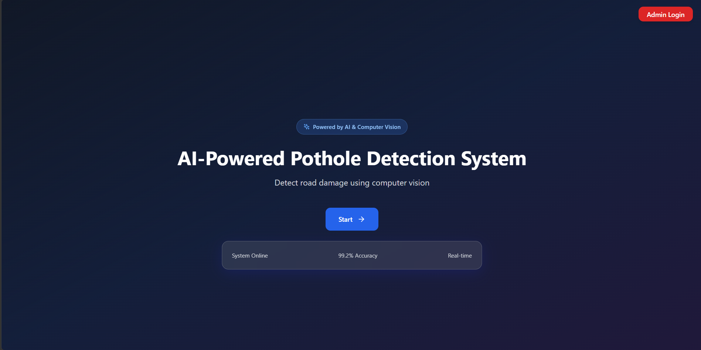
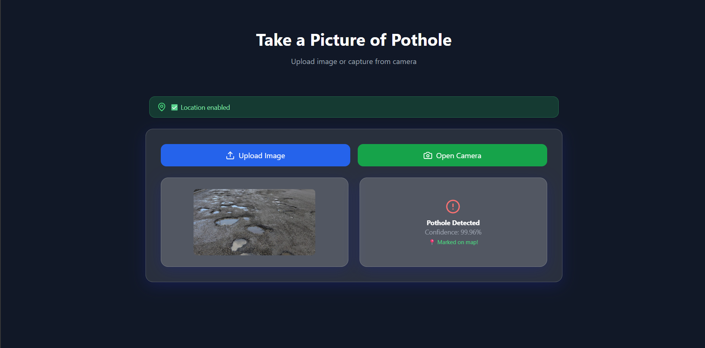
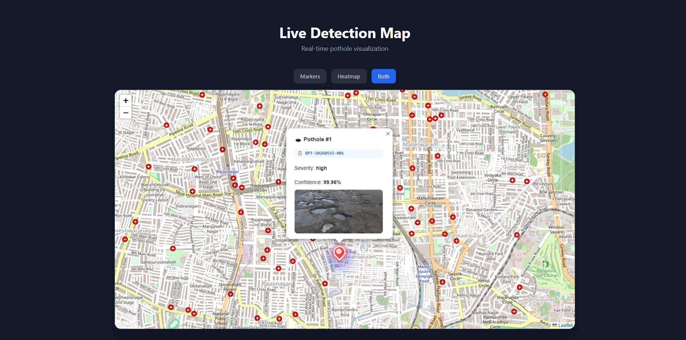
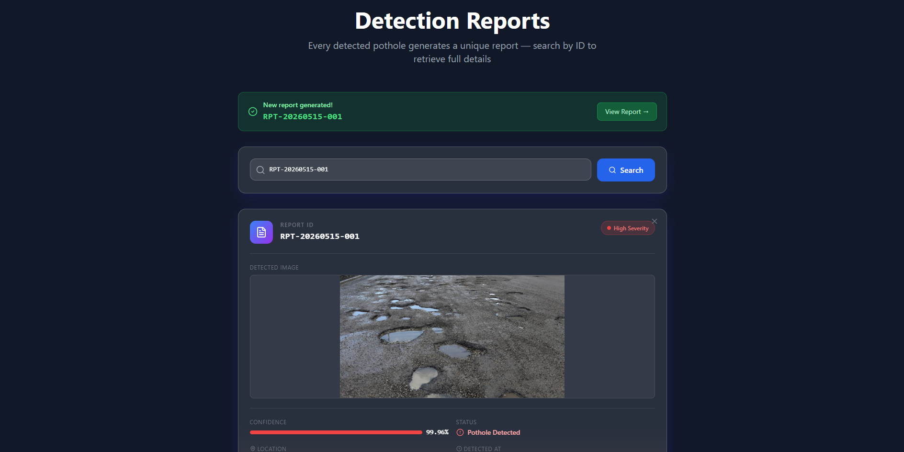

# 🚧 AI-Powered Pothole Detection System

An intelligent road damage detection platform built using **React**, **Flask**, **TensorFlow**, and **Computer Vision**.

This system detects potholes from uploaded road images using a deep learning model, automatically generates reports, visualizes detections on an interactive live map, and provides an admin dashboard for infrastructure monitoring.

---

# 📌 Features

## ✅ AI-Based Pothole Detection
- Detects potholes using a trained MobileNetV2 deep learning model
- Image upload and live camera support
- Confidence score generation
- Automatic severity classification

## 🗺️ Live Map Visualization
- Real-time pothole markers
- Interactive heatmap visualization
- Severity-based custom markers
- Fly-to latest detection feature

## 📋 Automated Reports System
- Unique report ID generation
- Detection metadata storage
- Search reports by ID
- Detailed pothole information

## 🔐 Admin Dashboard
- JWT authentication
- Protected admin routes
- View all reports
- Delete reports securely
- Search and manage reports

## 📸 Image Handling
- Upload pothole images
- Webcam capture support
- Server-side image storage
- Image preview in reports and map popups

## 📍 GPS Integration
- Automatic geolocation support
- Maps potholes using user coordinates
- Real-time location-based visualization

---

# 🧠 AI Model

The project uses:

- **TensorFlow / Keras**
- **MobileNetV2 Transfer Learning**
- Binary image classification

### Workflow

```text
Upload Image
→ Preprocess Image
→ AI Model Prediction
→ Generate Confidence Score
→ Create Report
→ Save Marker
→ Visualize on Map
```

---

# 🛠️ Tech Stack

## Frontend
- React
- TypeScript
- Tailwind CSS
- React Router
- Leaflet Maps
- React Webcam
- Lucide Icons

## Backend
- Flask
- Flask-CORS
- JWT Authentication
- TensorFlow
- Pillow
- NumPy

## AI / ML
- MobileNetV2
- Transfer Learning
- Computer Vision

---

# 📂 Project Structure

```text
ai-pothole-detection-system/
│
├── backend/
│   ├── app.py
│   ├── predict.py
│   ├── train.py
│   ├── requirements.txt
│   ├── markers.json
│   ├── reports.json
│
├── src/
│   ├── components/
│   ├── pages/
│   ├── App.tsx
│
├── package.json
├── vite.config.ts
└── README.md
```

---

# ⚙️ Installation

## 1️⃣ Clone Repository

```bash
git clone https://github.com/madhx3/ai-pothole-detection-system.git
```

---

## 2️⃣ Frontend Setup

```bash
npm install
npm run dev
```

Frontend runs at:

```text
http://localhost:5173
```

---

## 3️⃣ Backend Setup

Navigate to backend folder:

```bash
cd backend
```

Install dependencies:

```bash
pip install -r requirements.txt
```

Start Flask server:

```bash
python app.py
```

Backend runs at:

```text
http://localhost:5000
```

---

# 📡 API Endpoints

| Endpoint | Method | Description |
|---|---|---|
| `/predict` | POST | Predict potholes from uploaded image |
| `/markers` | GET | Get all pothole markers |
| `/markers` | POST | Save new pothole marker |
| `/reports` | GET | Get all reports |
| `/reports` | POST | Create report |
| `/reports/<id>` | GET | Get specific report |
| `/reports/<id>` | DELETE | Delete report |
| `/admin/login` | POST | Admin authentication |
| `/health` | GET | Server health check |

---

# 📷 Screenshots

## Homepage



---

## Live Detection



---

## Heatmap Visualization



---

## Admin Login


---

## Admin Dashboard


---

## Reports System



# 🔮 Future Improvements

- Real-time WebSocket updates
- PostgreSQL database integration
- YOLO object detection
- Mobile app support
- Route danger prediction
- Smart analytics dashboard
- Pothole clustering
- Municipal workflow system

---

# 🚀 Deployment

## Frontend
Recommended:
- Vercel

## Backend
Recommended:
- Render
- Railway

---

# 👨‍💻 Author

### Madhan

- GitHub: https://github.com/madhx3
- LinkedIn: https://www.linkedin.com/in/madhan-a-5003512a0

---

# ⭐ Support

If you found this project useful, consider giving it a star on GitHub ⭐

